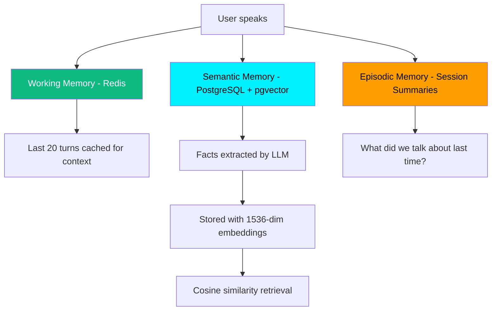

# GeordieDaz — Integration Roadmap & Connected Services

---

## Visual Mock-Up: Connected Services Interface


The mock-up above shows how connected services will appear inside the existing GeordieDaz JARVIS interface. The **left panel** (currently "Neural Memory Bank") expands to include a **Connected Services** section showing live data from all integrations. Users can ask GeordieDaz questions like *"Any new emails?"* or *"How's me Bitcoin doing?"* and get instant voice responses.

---

## Phase 1 — Core Voice AI (✅ COMPLETE)

| Feature | Status | Details |
|---------|--------|---------|
| Real-time voice conversation | ✅ Built | OpenAI Realtime API (gpt-realtime-mini) with WebSocket bridge |
| Alan Robson Geordie persona | ✅ Built | Custom system prompts with thick dialect enforcement |
| Driving Mode persona | ✅ Built | High-energy sarcastic co-pilot with fast punchy responses |
| Persistent memory (cross-session) | ✅ Built | PostgreSQL + pgvector semantic search + Redis working memory |
| JARVIS HUD interface | ✅ Built | 3-panel holographic UI with canvas-rendered voice orb |
| User authentication | ✅ Built | JWT access/refresh tokens with bcrypt password hashing |
| ElevenLabs voice clone | ✅ Built | Alan Robson voice clone created and integrated |
| Cloud deployment | ✅ Live | Backend on Render, Frontend on Vercel |

> **Blocked by:** OpenAI API credit balance ($0 remaining). Once credits are topped up, the full voice experience works end-to-end.

---

## Phase 2 — Proton Mail Integration

### How It Works
GeordieDaz connects to your Proton Mail account via the **Proton Mail Bridge** (official IMAP/SMTP gateway). This allows the AI to:

- **Read unread count:** "You've got 3 new emails, pet."
- **Summarize emails:** "One from your accountant about tax returns, and two from Amazon."
- **Compose & send replies:** "Send a reply saying 'Cheers, I'll look at it tomorrow.'"
- **Search inbox:** "Find that email from Dave about the meeting."

### Technical Architecture
```
User Voice → GeordieDaz Backend → Proton Bridge (IMAP/SMTP)
                                → Email parsed & summarized by LLM
                                → Response spoken back via voice
```

### Implementation
- **Backend service:** `email_service.py` — connects via IMAP to Proton Bridge
- **New tools for OpenAI Realtime:**
  - `check_email` — fetch unread count + subjects
  - `read_email` — summarize a specific email
  - `send_email` — compose and send via SMTP
- **Security:** OAuth tokens stored encrypted in PostgreSQL, never exposed to frontend
- **UI:** New "Mail" card in the Connected Services panel showing unread count

### Timeline: ~1 week after Phase 1 testing

---

## Phase 3 — Social Media Integration

### X (Twitter)
- **Read mentions & DMs:** "You've got 2 new mentions on X."
- **Post tweets:** "Post a tweet saying 'Howay the lads! NUFC forever.'"
- **Search trending:** "What's trending in Newcastle?"
- **API:** Twitter/X API v2 (OAuth 2.0)

### Instagram
- **Check DMs & notifications:** "You've got 1 new DM on Instagram."
- **View engagement stats:** "Your last post got 150 likes."
- **API:** Instagram Graph API (Meta Business Suite)

### Technical Architecture
```
User Voice → GeordieDaz Backend → Social Media APIs (OAuth 2.0)
                                → Data parsed & summarized
                                → Response spoken back
```

### Implementation
- **Backend services:** `twitter_service.py`, `instagram_service.py`
- **New Realtime tools:** `check_socials`, `post_tweet`, `check_instagram`
- **OAuth flow:** User authenticates once via browser → tokens stored securely
- **UI:** Social media cards in Connected Services panel with live counts

### Timeline: ~1-2 weeks after Phase 2

---

## Phase 4 — Crypto & Investment Tracking

### Cryptocurrency
- **Live portfolio tracking:** "Your Bitcoin's at £42,150 — up 2.1% today, canny!"
- **Price alerts:** "Bitcoin just hit £45,000, bonny lad!"
- **Holdings summary:** "Your total crypto portfolio is worth £68,400."
- **APIs:** CoinGecko (free tier) or CoinMarketCap

### Investment Portfolio
- **Stock tracking:** "Your Tesla shares are up 3.2% this week."
- **Portfolio performance:** "Overall portfolio is up 2.3% this month."
- **APIs:** Alpha Vantage, Yahoo Finance, or broker-specific APIs

### Technical Architecture
```
User Voice → GeordieDaz Backend → Crypto/Finance APIs
                                → Portfolio calculated & formatted
                                → Response spoken back with personality
```

### Implementation
- **Backend services:** `crypto_service.py`, `investment_service.py`
- **New Realtime tools:** `check_crypto`, `check_portfolio`, `set_price_alert`
- **Scheduled jobs:** Background tasks that fetch prices every 5 minutes and cache in Redis
- **UI:** Crypto & Investment cards in Connected Services panel with live prices and % changes

### Timeline: ~1 week after Phase 3

---

## Phase 5 — Future App Integrations

| Integration | Purpose | API |
|-------------|---------|-----|
| Google Calendar | "What's on me schedule today?" | Google Calendar API |
| Spotify | "Play some Geordie anthems" | Spotify Web API |
| Weather | "What's the weather like in Newcastle?" | OpenWeatherMap |
| News | "What's the latest Toon news?" | NewsAPI or RSS feeds |
| Smart Home | "Turn off the living room lights" | Home Assistant / Philips Hue API |
| WhatsApp | "Read my latest WhatsApp messages" | WhatsApp Business API |

### Plugin Architecture
Each integration follows the same pattern:
1. **Service file** in `backend/app/services/` — handles API communication
2. **Realtime tool** registered in `handler.py` — GeordieDaz can call it mid-conversation
3. **UI card** in the Connected Services panel — shows live data
4. **Memory integration** — GeordieDaz remembers your preferences ("You usually check crypto first thing")

---

## Memory Persistence Proof

GeordieDaz uses a **3-tier memory architecture** that persists permanently across sessions:



### Example Cross-Session Flow
1. **Monday Session:** User says "I just bought a Tesla Model 3"
   → `store_fact` tool fires → `entity_key: user.car.tesla` → stored permanently
2. **Friday Session (different device):** User says "What car do I drive?"
   → `search_memory` fires → finds `user.car.tesla` via vector search → GeordieDaz responds in Geordie

### Database Evidence
- **memories** table: Stores facts with pgvector embeddings, unique per entity per user
- **session_turns** table: Full conversation history with timestamps
- Both are in **PostgreSQL** (cloud-hosted), not in-memory — data survives restarts

---

## Handoff Confirmation

> **✅ CONFIRMED: All of the following will be included in the final handoff:**

| Deliverable | Included |
|-------------|----------|
| Complete source code (frontend + backend) | ✅ |
| All system prompts & persona configurations | ✅ |
| Memory extraction & retrieval logic | ✅ |
| LangGraph agent pipeline (7 nodes) | ✅ |
| Database schemas & migrations (Alembic) | ✅ |
| Docker Compose for local development | ✅ |
| Deployment configs (Render + Vercel) | ✅ |
| Environment variable templates (.env.example) | ✅ |
| API documentation (auto-generated via FastAPI /docs) | ✅ |
| Character Bible (Alan Robson persona guide) | ✅ |
| 28 automated tests | ✅ |
| README with full setup instructions | ✅ |

The complete repository is hosted on GitHub and can be transferred or cloned at any time.
